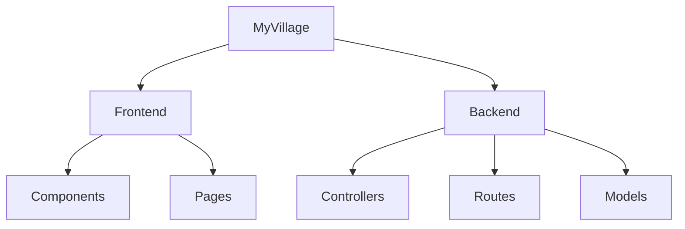
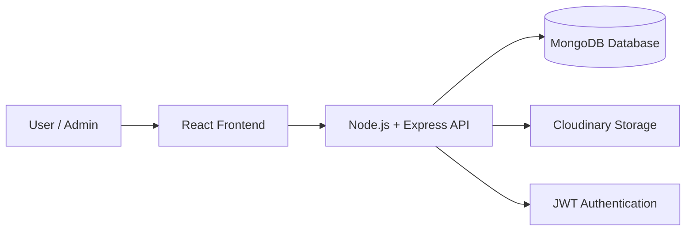
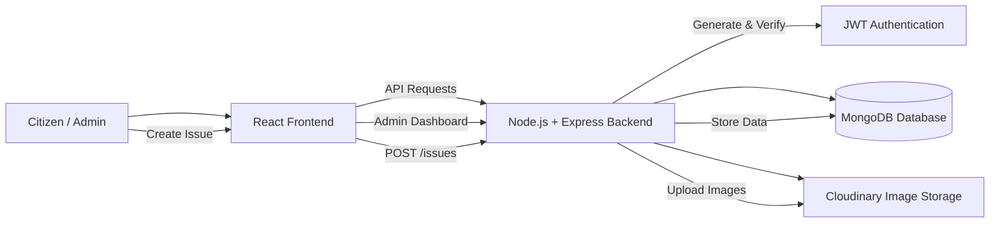
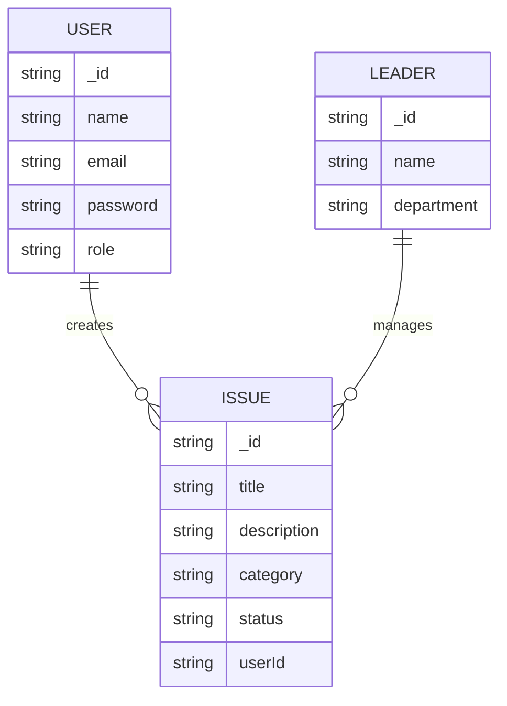

# MyVillage - Full Stack Application

## 📁 Folder Structure

## 📌 Project Architecture

# 🏘️ MyVillage - Full Stack Civic Issue Management System

## 📌 System Architecture

## 🗂 Database Schema

